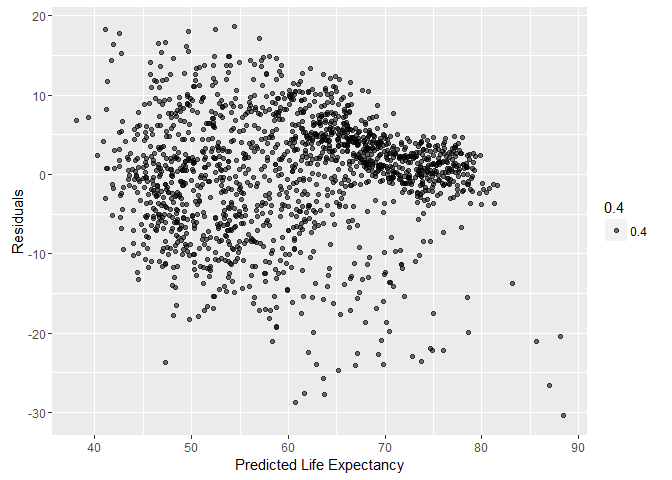
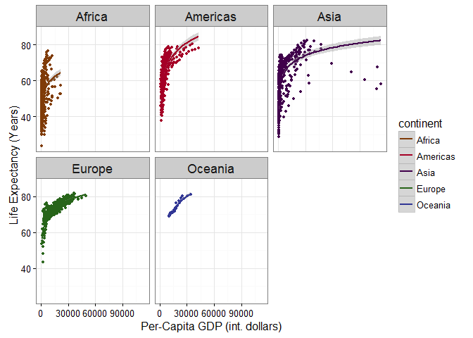
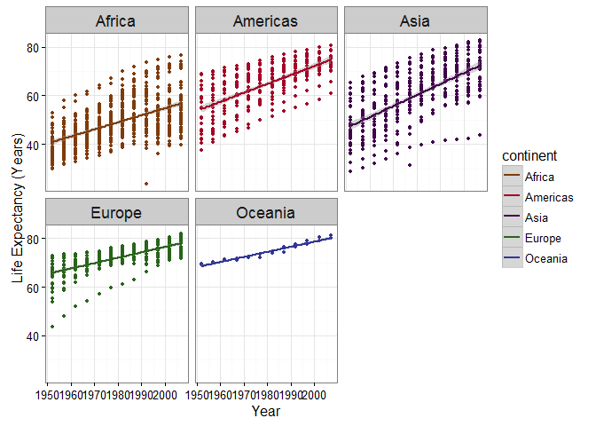
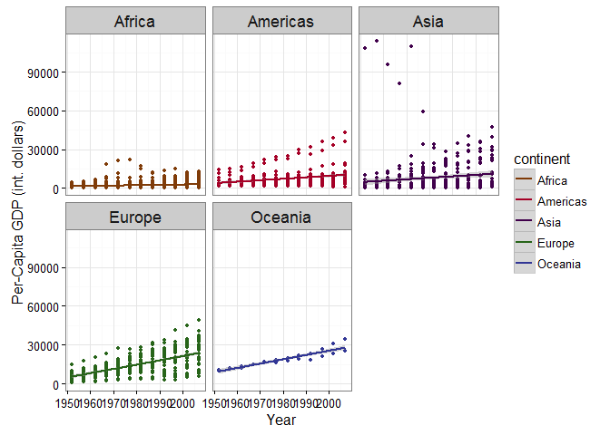
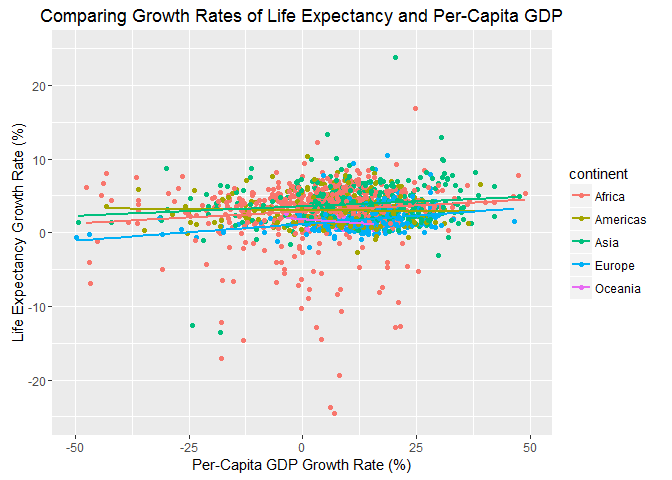

# Gapminder Group Project
David Dvorak, Elton Chan, Fanli Si, Jingyang Liu  
November 23, 2016  


# Our Hypothesis:
Countries with higher per-capita GDP have higher life expectancies.

# Our Analysis:


As an overview let us consider how life expectancy varies as a function of per-capita GDP:

<!-- --><!-- -->

The results of the linear regression are as follows:


```
## 
## Call:
## lm(formula = lifeExp ~ log(gdpPercap), data = df)
## 
## Residuals:
##     Min      1Q  Median      3Q     Max 
## -30.405  -3.846   1.008   4.484  18.611 
## 
## Coefficients:
##                Estimate Std. Error t value Pr(>|t|)    
## (Intercept)     -6.6903     1.2436   -5.38 8.59e-08 ***
## log(gdpPercap)   8.1727     0.1497   54.58  < 2e-16 ***
## ---
## Signif. codes:  0 '***' 0.001 '**' 0.01 '*' 0.05 '.' 0.1 ' ' 1
## 
## Residual standard error: 7.366 on 1560 degrees of freedom
## Multiple R-squared:  0.6563,	Adjusted R-squared:  0.6561 
## F-statistic:  2979 on 1 and 1560 DF,  p-value: < 2.2e-16
```

And the residuals look like:

<!-- -->

As a result we can say that there is a clear linear relationship between life expectancy and the logarithm of per-capita GDP.

To get a more clear picture about the relationship between life expectancy and per-capita GDP on different continents:

<!-- -->

It seems that GDP has a logarithmic relationship with life expectancy.

We can also look at how per-capita GDP and life expectancies have changed over time on each continent:

<!-- --><!-- -->

Interestingly, life expectancies across continents appear to increase a faster rate than per-capita GDP.

A follow-up question on the relationship between GDP and life expectancy is whether or not the rate of change of a country's life expectancy is impacted by the rate of change of its per-capita GDP. 

<!-- -->

The scatterplot includes linear regression lines for each continent and the fitting results are as follows:

Africa:

```
##                    Estimate Std. Error   t value     Pr(>|t|)
## (Intercept)      2.70734495 0.25087363 10.791668 7.840879e-25
## gdpPercap_change 0.02753237 0.01483351  1.856093 6.395617e-02
```
The Americas:

```
##                      Estimate  Std. Error    t value     Pr(>|t|)
## (Intercept)       3.024810146 0.135173900 22.3771760 1.047673e-63
## gdpPercap_change -0.004791989 0.009189733 -0.5214502 6.024759e-01
```
Asia:

```
##                    Estimate Std. Error  t value     Pr(>|t|)
## (Intercept)      3.44046305 0.21848781 15.74671 6.732981e-43
## gdpPercap_change 0.03596333 0.00906807  3.96593 8.817677e-05
```
Europe:

```
##                    Estimate  Std. Error   t value     Pr(>|t|)
## (Intercept)      1.35623616 0.107372981 12.631075 4.493767e-30
## gdpPercap_change 0.02992701 0.005904867  5.068194 6.722895e-07
```
Oceania:

```
##                     Estimate Std. Error   t value     Pr(>|t|)
## (Intercept)       1.77261150 0.32773153  5.408730 2.705971e-05
## gdpPercap_change -0.04345702 0.03295706 -1.318595 2.022055e-01
```

Note that the growth rate of per-capita GDP appears to have an impact on life expectancy growth rate for both Europe and Asia (p-value < 10<sup>-4</sup>), while having a minimal impact on the other continents.
